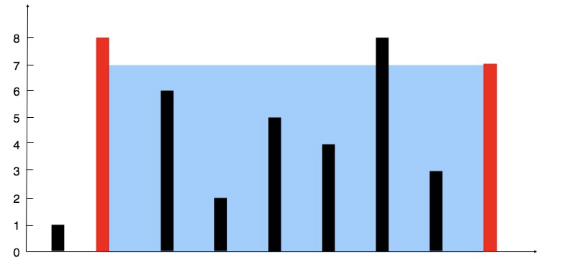

给你 n 个非负整数 a1，a2，...，an，每个数代表坐标中的一个点 (i, ai) 。在坐标内画 n 条垂直线，垂直线 i 的两个端点分别为 (i, ai) 和 (i, 0)。找出其中的两条线，使得它们与 x 轴共同构成的容器可以容纳最多的水。

说明：你不能倾斜容器，且 n 的值至少为 2。


图中垂直线代表输入数组 [1,8,6,2,5,4,8,3,7]。在此情况下，容器能够容纳水（表示为蓝色部分）的最大值为 49。
**示例**
```
输入：[1,8,6,2,5,4,8,3,7]
输出：49
```

**思路**
我们知道的柱子的高度，那么我们需要从两边向中间走，来计算谁的面积。
第一根柱子索引位为0，最后一根柱子索引位为`len(height)-1`，我们需要知道从左到右两个柱子的距离所以就是`j-i`就是长度。
这里我们需要按照柱子最小的来计算高度。


链接：https://leetcode-cn.com/problems/container-with-most-water
